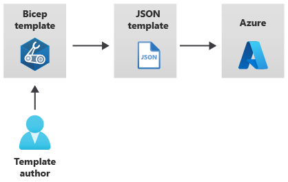

# Infrastructure as Code (IaC) with Bicep
Deploy and manage your Azure infrastructures with Azure native IaC framework Bicep.

---

## What's Bicep?
Bicep is a domain-specific language and an Azure-native IaC framework for deploying and managing Azure infrastructures in automation way, rathar than manually on Azure Portal. Unlike ARM JSON template, Bicep use it's own domain-specific language for provisioning Azure resources which makes a template very simple and human-readable.

---

## Benfits of Bicep
- Simpler syntax for writing templates
- Reference parameters and variables directly, without using complicated functions
- Break down complex template deployments into smaller module files and reference them in a main template
- You can directly deploy newly released or in preview Azure resources

... and much more.

## Bicep template vs. ARM JSON template
Behind the scenes, Bicep still operates with ARM JSON templates. When you submit a Bicep template to Resource Manager, the template going to be converted in JSON template. This propcess is called *transpilation*. But typically the template author doesn't come in touch with this process unless he wants to see the JSON template.




---

## Pre-requisites
### Download VS Code
[Download from the VS Code homepage](https://code.visualstudio.com/download)

### Install Azure CLI
[Download and install Azure CLI](https://docs.microsoft.com/en-us/cli/azure/install-azure-cli-windows?tabs=azure-cli). After that check your installation:
```
az version
```

Log in to your Azure account:
```
az login
```

List the available subscriptions in your directory:
```
az account list -o table
```

Choose the right subscription:
```
az account set --subscription "<your-subscription-id>"
```

### Download Bicep
Install Bicep extension in VS Code or type the folowing command in VS Code terminal:
```
az bicep install && az bicep upgrade
```

---

## Quick Start
Set the defaults resource group for the deployment:
```
az configure --defaults group=<resource-group-name>
```

Deploy the resources:
```
az deployment group create --template-file main.bicep
```

---

## Reference
[Bicep Docs](https://learn.microsoft.com/en-us/azure/azure-resource-manager/bicep/overview?tabs=bicep)

